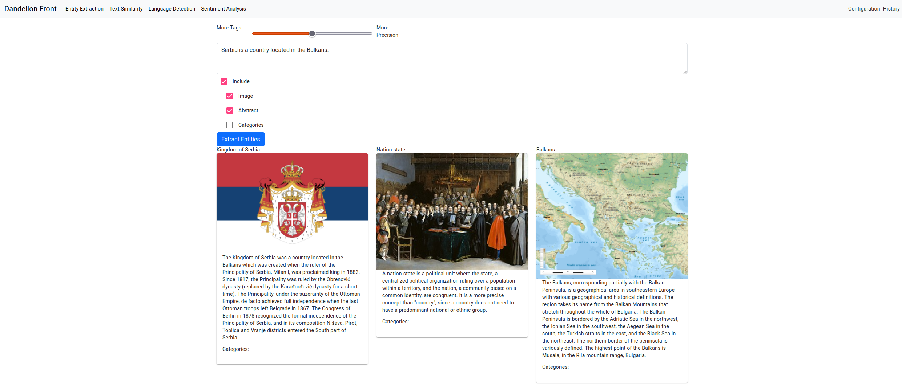
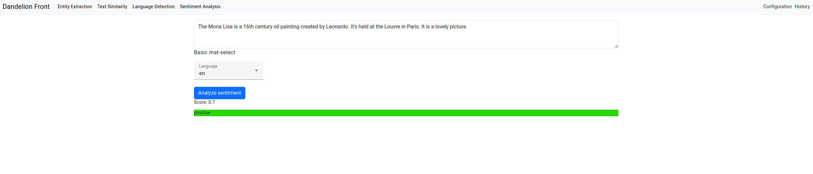
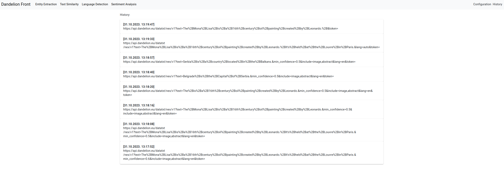

# Dandelion Front

Simple web frontend created in Angular for the subject Advanced Web Programming.
[Dandelion](https://dandelion.eu/)

## Content

### Configuration

Before the user starts with using the Web app, it should provide it's API token.

-----
### Entity Extraction

#### Inputs

- Text for extraction
- Slider which determines trade-off between more precision and more tags
- Include section
    - Image
    - Abstract
    - Categories

#### Output

Extracted entities with checked elements from the include section.

-----
### Text Similarity

#### Input

- Two texts

#### Output

Percentage of similarity between the texts.

-----
### Language Detection

#### Inputs

- Text for Language Detection
- Check box "Clean" - Text should/should not be cleaned from urls, links etc.

#### Output

List of languages and certainty percentages for each.

----
#### Sentiment Analysis

#### Inputs

- Text for Sentiment Analysis
- Language specifier (auto, en, it)

#### Output

Score how much is the provided text positive/negative. The color of the label for the sentiment type is interpolated according to score value(between red and green).

----
### History

History of all calls to Dandelion API.